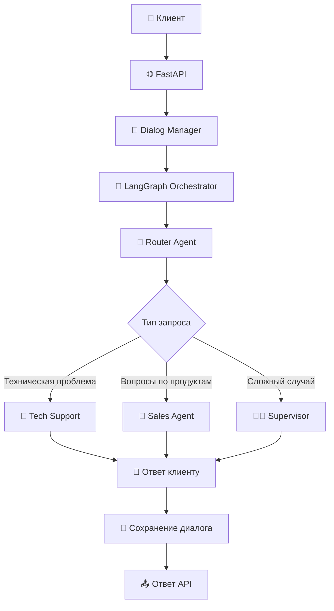

# 🎯 Call Center Agents

[](https://python.org)
[](https://fastapi.tiangolo.com)
[](https://github.com/langchain-ai/langgraph)
[](https://openai.com)
[](https://docker.com)

**Мультиагентная система для колл-центра** с использованием LangGraph для умной маршрутизации звонков между специализированными AI-агентами: техподдержка, продажи и контроль качества.

## 🎯 Основные возможности

### 🧠 **Интеллектуальная маршрутизация**
- **Автоматический роутинг**: определяет тип запроса и направляет к нужному агенту
- **Контекстно-зависимая обработка**: каждый агент специализируется на своей области
- **Эскалация к супервизору**: автоматическая передача сложных случаев

### ⚡ **Многоагентная архитектура**
- **Router Agent**: классификация и маршрутизация входящих запросов
- **Tech Support Agent**: решение технических проблем и поддержка
- **Sales Agent**: консультации по продуктам и продажи
- **Supervisor Agent**: контроль качества и сложные случаи

### 🏗️ **Production-ready решение**
- **LangGraph оркестрация** для управления потоком диалогов
- **Асинхронная обработка** с FastAPI
- **Персистентное хранение** диалогов в JSON формате
- **Docker контейнеризация** для простого развертывания
- **Структурированное логирование** для мониторинга

## 📚 Архитектура проекта

```
app/
├── 🎯 api/v1/              # REST API эндпоинты
│   ├── dialogue.py        # Управление диалогами
│   ├── health.py          # Проверка здоровья сервиса
│   └── router.py          # Роутинг API
├── 🤖 agents/             # AI агенты колл-центра
│   ├── base.py           # Базовый класс агента
│   ├── orchestrator.py   # LangGraph оркестратор
│   ├── prompts.py        # Системные промпты
│   ├── router.py         # Агент маршрутизации
│   ├── sales.py          # Агент продаж
│   ├── supervisor.py     # Агент-супервизор
│   └── tech_support.py   # Агент техподдержки
├── 🧠 core/              # Основная бизнес-логика
│   ├── config.py         # Конфигурация приложения
│   ├── exceptions.py     # Кастомные исключения
│   └── models.py         # Pydantic модели
└── 🔧 services/          # Сервисный слой
    ├── dialog_manager.py # Управление диалогами
    └── embeddings.py     # Работа с эмбеддингами
```

### 🔄 Поток обработки диалога



## 🛠️ Технологический стек

- **FastAPI** - современный веб-фреймворк для API
- **LangGraph** - оркестрация мультиагентных систем
- **OpenAI GPT-4o-mini** - языковая модель для агентов
- **LangChain** - фреймворк для работы с LLM
- **Pydantic** - валидация данных и сериализация
- **Docker** - контейнеризация и развертывание

## 🚀 Быстрый старт

### Требования

- **Python 3.11+**
- **Poetry** для управления зависимостями
- **OpenAI API ключ**
- **Docker** (опционально)

### Установка

1. **Клонирование проекта:**
```bash
git clone https://github.com/softkisik228/Call-Center-Agents.git
cd call-center-agents
```

2. **Установка зависимостей:**
```bash
poetry install
```

3. **Настройка окружения:**
```bash
cp .env.example .env
```

Отредактируйте `.env` файл:
```bash
# Обязательные настройки
OPENAI_API_KEY=sk-ваш-ключ-openai

# Опциональные настройки
OPENAI_MODEL=gpt-4o-mini
ENVIRONMENT=development
DEBUG=true
DIALOGS_STORAGE_PATH=storage/dialogs
```

4. **Создание необходимых директорий:**
```bash
mkdir -p storage/dialogs logs
```

5. **Запуск сервера разработки:**
```bash
# Активация виртуального окружения
poetry shell

# Запуск сервера
uvicorn app.main:app --reload --host 0.0.0.0 --port 8000
```

6. **Открыть документацию API:**
```
# Swagger UI
http://localhost:8000/docs

# ReDoc
http://localhost:8000/redoc
```

### 🐳 Запуск с Docker

```bash
# Сборка и запуск
docker-compose up --build

# Запуск в фоновом режиме
docker-compose up -d

# Просмотр логов
docker-compose logs -f
```

Приложение будет доступно по адресу: http://localhost:8000

## 💬 Примеры использования API

### 1. 🎬 Создание нового диалога

**Запрос:**
```bash
curl -X POST "http://localhost:8000/api/v1/dialogue/create" \
  -H "Content-Type: application/json" \
  -d '{
    "customer_id": "customer_123",
    "initial_message": "Не работает приложение, не могу войти в аккаунт"
  }'
```

**Ответ:**
```json
{
  "dialog_id": "a1b2c3d4-e5f6-7890-abcd-ef1234567890",
  "customer_id": "customer_123",
  "assigned_agent": "tech_support",
  "status": "active",
  "response": "Понимаю, что у вас проблемы с входом в приложение. Давайте разберемся с этой проблемой пошагово...",
  "created_at": "2024-01-15T10:30:00Z"
}
```

### 2. 💬 Продолжение диалога

**Запрос:**
```bash
curl -X POST "http://localhost:8000/api/v1/dialogue/a1b2c3d4-e5f6-7890-abcd-ef1234567890/message" \
  -H "Content-Type: application/json" \
  -d '{
    "message": "Пробовал перезагрузить телефон, но проблема осталась"
  }'
```

**Ответ:**
```json
{
  "dialog_id": "a1b2c3d4-e5f6-7890-abcd-ef1234567890",
  "current_agent": "tech_support",
  "response": "Хорошо, что вы попробовали перезагрузку. Теперь проверим следующие шаги: убедитесь, что у вас последняя версия приложения...",
  "status": "active",
  "tokens_used": 156,
  "processing_time": 2.1
}
```

### 3. 📊 Получение информации о диалоге

**Запрос:**
```bash
curl -X GET "http://localhost:8000/api/v1/dialogue/a1b2c3d4-e5f6-7890-abcd-ef1234567890"
```

**Ответ:**
```json
{
  "dialog_id": "a1b2c3d4-e5f6-7890-abcd-ef1234567890",
  "customer_id": "customer_123",
  "status": "active",
  "assigned_agent": "tech_support",
  "created_at": "2024-01-15T10:30:00Z",
  "updated_at": "2024-01-15T10:35:00Z",
  "message_count": 4,
  "total_tokens": 432,
  "messages": [
    {
      "role": "customer",
      "content": "Не работает приложение, не могу войти в аккаунт",
      "timestamp": "2024-01-15T10:30:00Z"
    },
    {
      "role": "tech_support",
      "content": "Понимаю, что у вас проблемы с входом...",
      "timestamp": "2024-01-15T10:30:15Z"
    }
  ]
}
```

### 4. 🏥 Проверка состояния системы

**Запрос:**
```bash
curl -X GET "http://localhost:8000/api/v1/health"
```

**Ответ:**
```json
{
  "status": "healthy",
  "timestamp": "2024-01-15T10:35:22Z",
  "version": "0.1.0",
  "environment": "development",
  "components": {
    "openai_api": "healthy",
    "dialog_storage": "healthy",
    "agents": "initialized"
  },
  "uptime": "2h 15m 33s"
}
```

### 5. 🔄 Завершение диалога

**Запрос:**
```bash
curl -X POST "http://localhost:8000/api/v1/dialogue/a1b2c3d4-e5f6-7890-abcd-ef1234567890/close" \
  -H "Content-Type: application/json" \
  -d '{
    "reason": "problem_resolved"
  }'
```

**Ответ:**
```json
{
  "dialog_id": "a1b2c3d4-e5f6-7890-abcd-ef1234567890",
  "status": "closed",
  "reason": "problem_resolved",
  "closed_at": "2024-01-15T10:45:00Z",
  "summary": {
    "total_messages": 6,
    "total_tokens": 567,
    "duration_minutes": 15,
    "resolution": "Проблема с входом в приложение решена путем переустановки"
  }
}
```

## 🤖 Агенты системы

### 🧭 Router Agent
**Назначение**: Анализирует входящие запросы и определяет наиболее подходящего агента

**Критерии маршрутизации**:
- Технические проблемы → Tech Support
- Вопросы о продуктах, ценах, покупке → Sales 
- Жалобы, сложные случаи → Supervisor

**Пример промпта**:
```
Ты агент-маршрутизатор колл-центра. Анализируй запросы клиентов и определяй:
- tech_support: технические проблемы, багы, неработающие функции
- sales: вопросы о продуктах, ценах, покупке, консультации
- supervisor: жалобы, возврат денег, сложные случаи
```

### 🔧 Tech Support Agent
**Специализация**: Решение технических проблем и поддержка пользователей

**Возможности**:
- Диагностика технических проблем
- Пошаговые инструкции по решению
- Эскалация к разработчикам при необходимости

**Пример работы**:
```
Клиент: "Приложение крашится при открытии"
Агент: "Давайте решим эту проблему пошагово:
1. Убедитесь, что у вас последняя версия
2. Перезагрузите устройство
3. Очистите кэш приложения..."
```

### 💼 Sales Agent  
**Специализация**: Консультации по продуктам и продажи

**Возможности**:
- Презентация продуктов и услуг
- Консультации по тарифам и ценам
- Оформление заказов и подписок

**Пример работы**:
```
Клиент: "Какие у вас тарифы?"
Агент: "У нас есть три основных тарифа:
- Базовый (990₽/мес): основной функционал
- Профи (1990₽/мес): расширенные возможности
- Бизнес (3990₽/мес): полный функционал..."
```

### 👨‍💼 Supervisor Agent
**Специализация**: Контроль качества и сложные случаи

**Возможности**:
- Разрешение конфликтных ситуаций
- Обработка жалоб и возвратов
- Принятие решений по нестандартным случаям

**Пример работы**:
```
Клиент: "Хочу вернуть деньги, сервис не работает!"
Агент: "Понимаю ваше недовольство. Давайте разберем ситуацию:
1. Расскажите подробнее о проблеме
2. Проверим возможности компенсации
3. Предложим варианты решения..."
```

## 🎛️ Конфигурация

### Основные настройки

| Параметр | Описание | По умолчанию |
|----------|----------|--------------|
| `OPENAI_API_KEY` | API ключ OpenAI (обязательно) | - |
| `OPENAI_MODEL` | Модель OpenAI для агентов | `gpt-4o-mini` |
| `ENVIRONMENT` | Окружение (development/production) | `development` |
| `DEBUG` | Режим отладки | `true` |
| `DIALOGS_STORAGE_PATH` | Путь для хранения диалогов | `storage/dialogs` |
| `LOG_LEVEL` | Уровень логирования | `INFO` |
| `MAX_DIALOG_HISTORY` | Макс. сообщений в контексте | `20` |

### Конфигурация агентов

#### 🤖 **Настройки LLM**
- **OPENAI_MODEL**: Модель для всех агентов (рекомендуется `gpt-4o-mini`)
- **TEMPERATURE**: Креативность ответов (0.0-2.0, по умолчанию 0.7)
- **MAX_TOKENS**: Максимальная длина ответа (по умолчанию 1000)

#### 🔄 **LangGraph конфигурация**
- **RECURSION_LIMIT**: Максимум итераций в графе (по умолчанию 50)
- **ENABLE_MEMORY**: Использование памяти между сессиями
- **CHECKPOINT_STORAGE**: Путь для сохранения состояний

### Хранение диалогов

#### 📁 **Структура файлов**
Каждый диалог сохраняется в отдельном JSON файле:
```
storage/dialogs/
├── a1b2c3d4-e5f6-7890-abcd-ef1234567890.json
├── b2c3d4e5-f6g7-8901-bcde-f23456789012.json
└── ...
```

#### 📝 **Формат диалога**
```json
{
  "dialog_id": "uuid",
  "customer_id": "string", 
  "status": "active|closed",
  "assigned_agent": "tech_support|sales|supervisor",
  "created_at": "iso_datetime",
  "updated_at": "iso_datetime",
  "messages": [
    {
      "role": "customer|agent",
      "content": "text",
      "timestamp": "iso_datetime",
      "agent_type": "router|tech_support|sales|supervisor"
    }
  ],
  "metadata": {
    "total_tokens": 0,
    "processing_times": [],
    "handoffs": []
  }
}
```

## 📊 Мониторинг и аналитика

### Логирование

Структурированные логи включают:
- **Инициализация агентов**: Статус запуска каждого агента
- **Обработка диалогов**: Время обработки, использованные токены
- **Маршрутизация**: Решения о передаче между агентами
- **Ошибки**: Детальная информация об исключениях

### Метрики производительности

- **Время отклика**: Среднее время обработки запросов
- **Использование токенов**: Статистика по потреблению OpenAI API
- **Успешность маршрутизации**: Точность определения нужного агента
- **Удовлетворенность клиентов**: На основе завершения диалогов

### Health Check эндпоинты

```bash
# Базовая проверка системы
curl http://localhost:8000/api/v1/health

# Детальная проверка компонентов
curl http://localhost:8000/api/v1/health/detailed

# Проверка готовности к работе
curl http://localhost:8000/api/v1/health/ready
```

## 🛠️ Разработка

### Команды для разработки

```bash
# Установка зависимостей
poetry install

# Проверка кода
poetry run black .
poetry run isort .

# Запуск локально
poetry run uvicorn app.main:app --reload

# Запуск тестов
poetry run pytest

# Проверка типов
poetry run mypy .
```

### Структура конфигурации

```bash
# Файлы конфигурации
pyproject.toml          # Poetry зависимости и настройки
.env.example           # Шаблон переменных окружения
docker-compose.yaml    # Docker композиция
Dockerfile            # Образ для контейнеризации
.dockerignore         # Исключения для Docker
.gitignore            # Исключения для Git
```

### Добавление нового агента

1. **Создайте класс агента** в `app/agents/`:
```python
from app.agents.base import BaseAgent

class CustomAgent(BaseAgent):
    def __init__(self):
        super().__init__(
            name="custom_agent",
            system_prompt="Ваш системный промпт..."
        )
    
    async def process_message(self, message: str) -> str:
        # Логика обработки сообщения
        return await self.get_llm_response(message)
```

2. **Добавьте агента в оркестратор** (`app/agents/orchestrator.py`)

3. **Обновите маршрутизацию** в Router Agent

## 🐳 Docker развертывание

### Локальная разработка

```bash
# Сборка образа
docker build -t call-center-agents .

# Запуск контейнера
docker run -p 8000:8000 \
  -e OPENAI_API_KEY=sk-ваш-ключ \
  -e OPENAI_MODEL=gpt-4o-mini \
  -v $(pwd)/storage:/app/storage \
  call-center-agents
```

### Production развертывание

```yaml
# docker-compose.prod.yml
version: '3.8'

services:
  call-center-api:
    image: call-center-agents:latest
    ports:
      - "${PORT:-8000}:8000"
    environment:
      - OPENAI_API_KEY=${OPENAI_API_KEY}
      - OPENAI_MODEL=${OPENAI_MODEL:-gpt-4o-mini}
      - ENVIRONMENT=production
      - DEBUG=false
      - LOG_LEVEL=INFO
    volumes:
      - ./storage:/app/storage
      - ./logs:/app/logs
    restart: unless-stopped
    healthcheck:
      test: ["CMD", "curl", "-f", "http://localhost:8000/api/v1/health"]
      interval: 30s
      timeout: 10s
      retries: 3
      start_period: 40s
```

## 🔧 Производство

### Рекомендации для production

1. **Безопасность**:
   - Используйте secrets для API ключей
   - Настройте CORS для конкретных доменов
   - Добавьте rate limiting для API
   - Логирование всех операций

2. **Масштабирование**:
   - Горизонтальное масштабирование через load balancer
   - Использование внешней базы данных для диалогов
   - Кэширование часто используемых данных
   - Мониторинг ресурсов и автомасштабирование

3. **Мониторинг**:
   - Structured logging в JSON формате
   - Метрики через Prometheus/Grafana
   - Алерты на критические ошибки
   - Мониторинг использования OpenAI API

4. **Оптимизация**:
   - Батчинг запросов к OpenAI
   - Оптимизация промптов для экономии токенов
   - Кэширование ответов для типовых вопросов
   - Регулярный анализ и улучшение агентов

### Переменные окружения для production

```bash
# .env.production
OPENAI_API_KEY=sk-real-production-key
OPENAI_MODEL=gpt-4o-mini
ENVIRONMENT=production
DEBUG=false
LOG_LEVEL=INFO
DIALOGS_STORAGE_PATH=/data/dialogs
MAX_DIALOG_HISTORY=20
CORS_ORIGINS=https://yourdomain.com,https://app.yourdomain.com
```

## � Последние обновления

### v0.1.1 - Исправление памяти агентов
**Проблема:** При переключении между агентами в рамках одного запроса (sales → tech_support → router) каждый следующий агент не видел контекст от предыдущих агентов, что приводило к потере важной информации из диалога.

**Решение:** Добавлено обновление `state.message_history` в каждом узле LangGraph графа (`_router_node`, `_tech_support_node`, `_sales_node`). Теперь каждый агент перед передачей управления добавляет в историю текущий обмен (вопрос пользователя + свой ответ), благодаря чему все последующие агенты видят полный контекст и могут корректно отвечать даже после множественных переключений.

**Результат:** Система теперь корректно сохраняет контекст при сложных сценариях с множественными переключениями между агентами, что улучшает качество ответов и пользовательский опыт.

## �🚀 Roadmap

### Краткосрочные планы
- [ ] Интеграция с внешними CRM системами
- [ ] Аналитика и отчеты по диалогам
- [ ] Веб-интерфейс для мониторинга
- [ ] Поддержка голосовых звонков

### Долгосрочные планы
- [ ] Обучение кастомных моделей на данных компании
- [ ] Интеграция с базами знаний (RAG)
- [ ] Поддержка мультиязычности
- [ ] Real-time уведомления и WebSocket API

## 🤝 Contributing

1. Fork репозиторий
2. Создайте feature branch (`git checkout -b feature/amazing-feature`)
3. Commit изменения (`git commit -m 'Add amazing feature'`)
4. Push в branch (`git push origin feature/amazing-feature`)
5. Создайте Pull Request

### Правила разработки

- Все изменения должны быть покрыты тестами
- Код должен проходить линтинг (black, isort)
- Добавляйте docstrings для новых функций
- Обновляйте документацию при необходимости

## 📄 License

MIT License - см. файл [LICENSE](LICENSE) для деталей.
